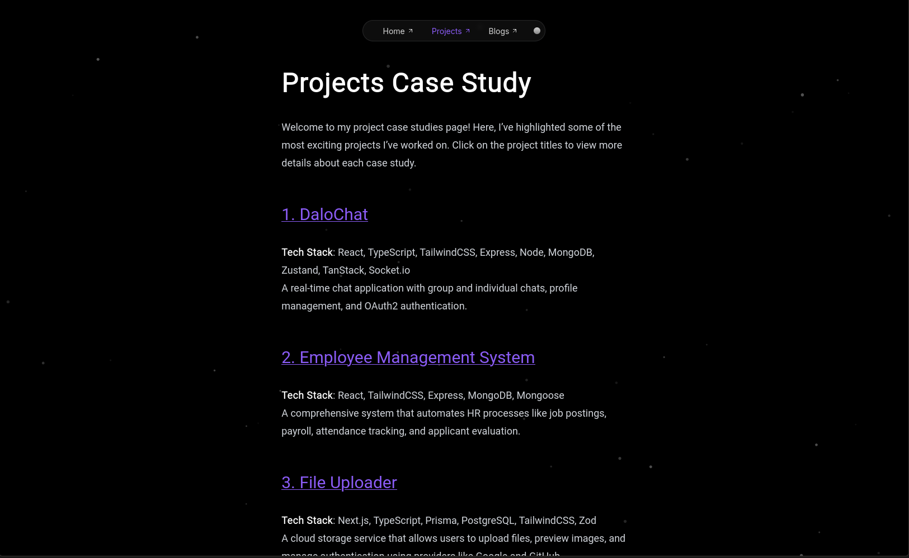

# My Journey

Welcome to my personal portfolio, built using modern technologies including **Next.js**, **Shadcn/UI**, **TailwindCSS**, **MDX**, and **TypeScript**. This portfolio showcases my projects, blogs, and skills, with smooth animations and responsive design.

## 🛠️ Tech Stack

-   **Framework:** [Next.js](https://nextjs.org/)
-   **UI Components:** [Shadcn/UI](https://ui.shadcn.dev/)
-   **Styling:** [TailwindCSS](https://tailwindcss.com/)
-   **Markdown Support:** [MDX](https://mdxjs.com/)
-   **Type Checking:** [TypeScript](https://www.typescriptlang.org/)

## ✨ Features

-   **Blogs Page:** Explore in-depth blogs written using MDX, with code snippets and rich formatting.
-   **Projects Case Studies:** A dedicated section showcasing detailed case studies for my key projects.
-   **Responsive Design:** The site is fully responsive and works seamlessly across all devices.

## 📸 Screenshots

### Homepage


### Projects Section



### Blog Page


## 🚀 Getting Started

### 1. Clone the repository:

```bash
git clone https://github.com/iamsuudi/journey.git
cd your-portfolio
```

### 2. Install dependencies:

```bash
pnpm install
```

### 3. Start the development server:

```bash
pnpm dev
```

### 4. Build for production:

```bash
pnpm run build
pnpm start
```

## 🔗 Live Demo

Check out the live version of the portfolio: [My Portfolio](https://sh.abdulfetah.com/)

## 🤝 Contributing

Feel free to fork the project and submit pull requests if you'd like to contribute!
